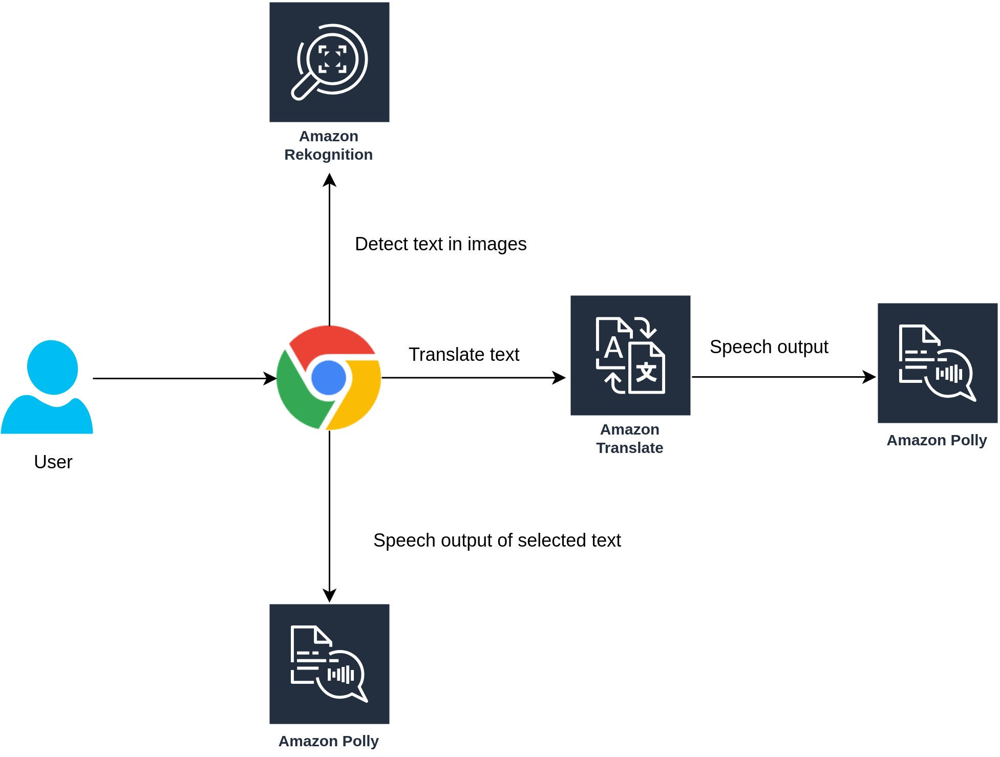

# Feel

Ever wanted to go through a blog or read a website while working or tell your browser to dictate you the content of your favourite news website or a celebrity news. Feels does the work for you. It leverages Amazon Artificial Intelligence Services like Polly, Translate and Rekognition to read out your favourite blog, translate the web page or just a part of it and even extract text from images present on these web pages.

## Flow Diagram

## AWS Services Used
* Amazon Polly
* Amazon Translate
* Amazon Rekognition

## How to Run

* Open Google Chrome and visit the extensions page with Developer mode enabled.
* Click on Load Unpacked and select the **src** folder.
* Enter **AWS Access Key ID** and **Secret Access Key** and **Region** (tested for us-east-1). This has been done to prevent unknown usage. In production mode it shall be replaced with ready to go popup.
* Click Save.
* Now select any text and translate it or use polly to dictate it or rekognition to extract text from images.
